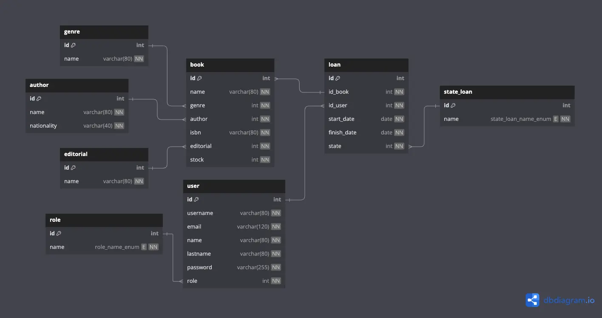

# **Backend Sistema de Prestamo de Libros**

Proyecto de backend con **Node.JS, Express y TypeScript**, Ademas como motor de base de datos se utilizo **MySQL**.

## Requisitos

- [Node.JS](https://nodejs.org/en)
- [MySQL](https://www.mysql.com/)

# Como empezar

Clonar repositorio en equipo local

```bash
git clone https://github.com/DarkMalk/backend-sis-prestamo-libros.git
```

Ingresar al proyecto (carpeta)

```bash
cd backend-sis-prestamo-libros
```

Instalar dependencias

```bash
pnpm install
```

**NOTA:** Reemplazar por el manejador de paquetes que utilices, `npm` o `yarn`.

# Creación de base de datos MySQL

Para la creación de las tablas necesarias para este proyecto en la base de datos `MySQL` podemos utilizar el archivo de referencia en la carpeta `files/create_db.sql`, que contiene todas las operaciones necesarias para empezar a funcionar con el proyecto.



### Configuración de variables de entorno

Existen 3 modos para iniciar este proyecto los cuales corresponden a:

1. development
2. production
3. test

para cada uno de estos se debe configurar las variables de entorno con sus respectivos nombres

```bash
touch development.env
touch production.env
touch test.env
```

Estos archivos deben tener la siguiente información que es requerida para que funcione el proyecto, esto se puede tomar de ejemplo el archivo del repositorio `.env.example`.

**NOTA:** la variable de entorno `PORT` es opcional ya que por defecto tomara el puerto `3000` si es que no le pasamos un número de puerto.

_Ejemplo:_

```bash
# PORT for listen server
PORT=3000

# DB
HOST="localhost"
USERNAME="root"
PASSWORD="root"
DATABASE="biblioteca"

# JsonWebToken
JSONWEBTOKEN_SECRET="test"
```

### Comandos para iniciar proyecto.

Iniciar modo producción

```bash
pnpm start
```

Iniciar modo desarrollo

```bash
pnpm run dev
```

Iniciar modo test

```bash
pnpm run test
```

**NOTA:** reemplazar el manejador de paquetes por `npm` o `yarn` si es necesario, en este caso se muestra con pnpm.

# Documentación de la API

> [!IMPORTANT]
> Para las **rutas protegidas** en la petición HTTP debes pasarle la cabecera `Authorization` con el método `Bearer` seguido del token que obtienes al iniciar sesión con desde la ruta de la API `/api/user/login`.

## GET `/api/user`

Esta ruta nos permite traernos todos los usuarios registrados en la plataforma

**Requisitos:**

- Autenticación: Debes estar autenticado con un usuario con rol `librarian`

## Response

```json
[
  {
    "id": 1,
    "username": "admin",
    "email": "admin@test.com",
    "name": "admin",
    "lastname": "admin",
    "role": "librarian"
  },
  {
    "id": 2,
    "username": "client",
    "email": "client@test.com",
    "name": "client",
    "lastname": "client",
    "role": "client"
  }
]
```

## POST `/api/user/login`

Esta ruta nos permite iniciar sesión en la plataforma, nos devolverá varios datos del usuario más el token de autorización el cual sera necesario guardar para pasarla a las rutas protegidas.

## **Body**

```json
{
  "username": "admin",
  "password": "admin"
}
```

## **Response**

```json
{
  "token": "token_generado",
  "id": 1,
  "username": "admin",
  "email": "admin@test.com",
  "name": "admin",
  "lastname": "admin",
  "role": "librarian"
}
```

## POST `/api/user/register`

Esta ruta nos permite registrar un nuevo usuario en la plataforma.

**Requisitos:**

- Autenticación: Debes estar autenticado con un usuario con rol `librarian`

## **Body**

```json
{
  "username": "newuser",
  "email": "newuser@test.com",
  "name": "New",
  "lastname": "User",
  "password": "password123",
  "role": "client"
}
```

## **Response**

```json
{
  "id": 3,
  "username": "newuser",
  "email": "newuser@test.com",
  "name": "New",
  "lastname": "User",
  "role": "client"
}
```

---

## GET `/api/role`

Esta ruta nos permite obtener todos los roles disponibles en la plataforma.

## **Response**

```json
[
  {
    "id": 1,
    "name": "librarian"
  },
  {
    "id": 2,
    "name": "client"
  }
]
```

---

## GET `/api/role/:id`

Esta ruta nos permite obtener un rol específico por su ID.

## **Response**

```json
{
  "id": 1,
  "name": "librarian"
}
```

## GET `/api/genre`

Esta ruta nos permite obtener todos los géneros que se encuentran en la plataforma.

## **Response**

```json
[
  {
    "id": 1,
    "name": "Ciencia ficción y aventura"
  },
  {
    "id": 2,
    "name": "Novela gótica"
  },
  {
    "id": 3,
    "name": "Novela histórica y realismo mágico"
  },
  {
    "id": 4,
    "name": "Novela negra"
  }
]
```

## POST `/api/genre`

Esta ruta nos permite crear un nuevo genero en la plataforma

**Requisitos:**

- Autenticación: Debes estar autenticado con un usuario con rol `librarian`

## **Body**

```json
{
  "name": "Novela Gráfica"
}
```

## **Response**

```json
{
  "id": 1,
  "name": "Novela Gráfica"
}
```

## DELETE `/api/genre/:id`

Esta ruta nos permite eliminar un genero registrado en la plataforma mediante su identificador `id`, esta ruta te devolverá un código de estado 204 (no content) una vez sea eliminado el genero.

**Requisitos:**

- Autenticación: Debes estar autenticado con un usuario con rol `librarian`

## PUT `/api/genre/:id`

Esta ruta nos permite editar un genero registrado en la plataforma.

**Requisitos:**

- Autenticación: Debes estar autenticado con un usuario con rol `librarian`

## **Body**

```json
{
  "name": "Nombre actualizado"
}
```

## **Response**

```json
{
  "id": 1,
  "name": "Nombre actualizado"
}
```

## GET `/api/author`

Esta ruta nos permite obtener todos los autores registrados en la plataforma.

## **Response**

```json
[
  {
    "id": 1,
    "name": "William Shakespeare",
    "nationality": "Inglaterra"
  },
  {
    "id": 2,
    "name": "Ernest Hemingway",
    "nationality": "Estados Unidos"
  }
]
```

## POST `/api/author`

Esta ruta nos permite registrar un nuevo autor a la plataforma.

**Requisitos:**

- Autorización: Debes estar autenticado con un usuario con rol `librarian`

## **Body**

```json
{
  "name": "Agatha Christie",
  "nationality": "Reino Unido"
}
```

## **Response**

```json
{
  "id": 3,
  "name": "Agatha Christie",
  "nationality": "Reino Unido"
}
```

## DELETE `/api/author/:id`

Esta ruta nos permite eliminar un autor de la plataforma mediante su identificador `id`, al momento de eliminar el autor del registro, la ruta nos devolverá un código de estado 204 (no content).

**Requisitos:**

- Autorización: Debes estar autenticado con un usuario con rol `librarian`

## PUT `/api/author/:id`

Esta ruta nos permite editar un autor registrado en la plataforma mediante su identificador `id`.

**Requisitos:**

- Autorización: Debes estar autenticado con un usuario con rol `librarian`

## **Body**

```json
{
  "name": "nuevo nombre",
  "nationality": "nueva nacionalidad"
}
```

## **Response**

```json
{
  "id": 3,
  "name": "nuevo nombre",
  "nationality": "nueva nacionalidad"
}
```

## GET `/api/book`

Esta ruta nos permite obtener todos los libros registrados en la plataforma.

## **Response**

```json
[
  {
    "id": 1,
    "name": "El sol también se pone para los locos",
    "genre": "Novela histórica y realismo mágico",
    "author": "Ernest Hemingway",
    "isbn": "978-0-06-051064-3",
    "editorial": "Scribner",
    "stock": 30
  },
  {
    "id": 2,
    "name": "Crímenes y pecados",
    "genre": "Novela gótica",
    "author": "Fyodor Dostoyevsky",
    "isbn": "978-0-14-026088-9",
    "editorial": "Penguin Classics",
    "stock": 15
  },
  {
    "id": 3,
    "name": "Harry Potter y la piedra filosofal",
    "genre": "Literatura infantil",
    "author": "J. K. Rowling",
    "isbn": "978-1-4088-0354-9",
    "editorial": "Bloomsbury Publishing Plc",
    "stock": 30
  }
]
```

## GET `/api/book/:id`

Esta ruta nos permite obtener un libro por su identificador `id`

## **Response**

```json
{
  "id": 3,
  "name": "Harry Potter y la piedra filosofal",
  "genre": "Literatura infantil",
  "author": "J. K. Rowling",
  "isbn": "978-1-4088-0354-9",
  "editorial": "Bloomsbury Publishing Plc",
  "stock": 30
}
```

## POST `/api/book`

Esta ruta nos permite registrar un nuevo libro en la plataforma.

**Requisitos:**

- Autorización: Debes estar autenticado con un usuario con rol `librarian`.

## **Body**

```json
{
  "name": "New Book Title",
  "author": 1, // Author ID
  "isbn": "978-3-16-148410-0",
  "editorial": 1, // Editorial ID
  "genre": 1, // Genre ID
  "stock": 10
}
```

## **Response**

```json
{
  "id": 4,
  "name": "New Book Title",
  "genre": "Ciencia ficción y aventura",
  "author": "William Shakespeare",
  "isbn": "978-3-16-148410-0",
  "editorial": "Editorial Ejemplo",
  "stock": 10
}
```
